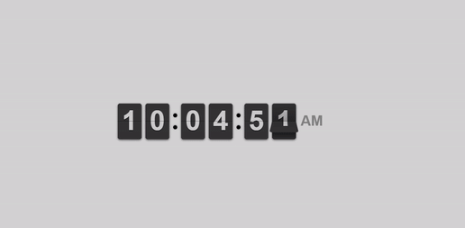

# 3D Digital Clock ⏰

A stunning, modern 3D digital clock with animated cosmic background and glass morphism design. Features a beautiful flip-style clock display with fullscreen capability and responsive design.



## ✨ Features

- **🌌 Animated Cosmic Background**: Dynamic moving GIF background for an immersive experience
- **🕒 Flip Clock Animation**: Smooth flip-style digital clock with realistic 3D effects
- **🔍 Fullscreen Mode**: Toggle fullscreen with button or keyboard shortcuts
- **💎 Glass Morphism Design**: Modern frosted glass effect with backdrop blur
- **📱 Responsive Design**: Adapts beautifully to different screen sizes
- **🌈 Glowing Effects**: Alternating blue and purple glow animations on clock digits
- **⏰ 12-Hour Format**: Displays time in 12-hour format with AM/PM indicator
- **✨ Hover Animations**: Interactive elements with smooth hover effects

## 🚀 Quick Start

1. **Clone or Download** the project files
2. **Open** `index.html` in your web browser  
3. **Enjoy** your beautiful 3D digital clock!

No installation or setup required - just open and run!

## 📁 Project Structure

```
clock/
├── index.html          # Main HTML file
├── style.css           # All styling and animations
├── README.md           # This file
├── 3d_digital_clock.gif # Local background animation
└── image/
    └── clock.svg       # Favicon icon
```

## 🎮 Controls

### Fullscreen Mode
- **Click** the fullscreen button (top-right corner)
- **Press** `F11` key
- **Press** `F` key
- **Exit** by clicking the button again or pressing `Esc`

## 🎨 Customization

### Change Background
Edit the background URL in `style.css`:
```css
background: url('your-gif-url-here') center center / cover no-repeat;
```

### Modify Colors
Customize the color scheme by editing these CSS variables:
- Clock container background: `rgba(0, 0, 0, 0.7)`
- Glow colors: Blue `#3498db`, Purple `#9b59b6`
- Dot color: Red `#e74c3c`

### Adjust Clock Size
Modify clock dimensions in `.flip-clock-wrapper ul`:
```css
width: 80px;    /* Digit width */
height: 120px;  /* Digit height */
font-size: 80px; /* Font size */
```

## 🛠️ Technologies Used

- **HTML5**: Structure and semantics
- **CSS3**: Styling, animations, and effects
  - Glass morphism design
  - CSS animations and keyframes
  - Responsive design with media queries
- **JavaScript/jQuery**: Clock functionality and interactions
- **FlipClock.js**: Flip animation library
- **External Resources**:
  - jQuery 2.1.1
  - FlipClock CSS & JS libraries

## 📱 Browser Compatibility

- ✅ Chrome (recommended)
- ✅ Firefox
- ✅ Safari
- ✅ Edge
- ✅ Mobile browsers

## 🎯 Key Features Breakdown

### Glass Morphism Effect
- Backdrop blur filter for modern glass appearance
- Semi-transparent backgrounds with subtle borders
- Layered visual depth with proper z-indexing

### 3D Perspective
- CSS transforms for 3D rotation effects
- Perspective scaling on hover interactions
- Smooth transitions for all animations

### Responsive Design
- Mobile-friendly layout adjustments
- Scalable clock digits for smaller screens
- Maintained visual quality across devices

### Performance Optimized
- Efficient CSS animations
- Minimal JavaScript overhead
- Fast loading with CDN resources

## 🔧 Advanced Customization

### Adding New Clock Faces
You can change the clock format by modifying the FlipClock initialization:
```javascript
var clock = $('.clock').FlipClock({
    clockFace: 'TwentyFourHourClock'  // 24-hour format
    // Other options: 'HourlyCounter', 'MinuteCounter', etc.
});
```

### Custom Animations
Add your own animations by creating new CSS keyframes:
```css
@keyframes yourAnimation {
    0% { /* start state */ }
    100% { /* end state */ }
}
```

## 📄 License

This project is open source and available under the [MIT License](LICENSE).

## 🤝 Contributing

Feel free to contribute to this project by:
- Reporting bugs
- Suggesting new features
- Submitting pull requests
- Improving documentation

## 📧 Contact

If you have any questions or suggestions, feel free to reach out!

---

**Enjoy your beautiful 3D Digital Clock! ⏰✨**

